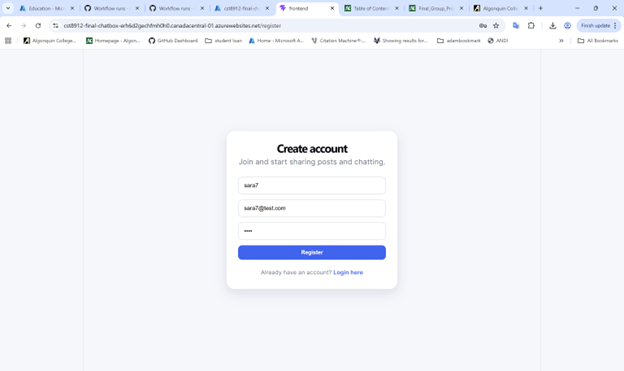

# Cloud-Based Social Media Application

## Final Project Report (Phase 3)

### Course: CST8912 Cloud Solution Architecture

### Group #: 2

### Team Members:

* Hesheng Yang
* Yiming He
* Sara Mirzaeipouynak
* Bosi Chen
* Xinyi Zhao

### Date: April 16 2026

---

# Table of Contents

1. Introduction
2. Project Overview
3. Phase 2 Summary
4. Improvements from Phase 2
5. System Architecture
6. Cloud Technologies Used
7. Features Implementation
8. Connectivity and Integration
9. Challenges and Solutions
10. Future Improvements
11. Conclusion
12. References

---

# 1. Introduction

Cloud computing enables scalable, flexible, and efficient deployment of modern applications. Organizations increasingly rely on cloud-based architectures to deliver responsive and reliable services (Microsoft, 2024).

This project presents a cloud-based social media application designed using Microsoft Azure services. The system demonstrates how frontend, backend, and cloud services can be integrated into a complete solution that supports real-time communication, media storage, and user interaction.

---

# 2. Project Overview

The application is a full-stack system consisting of:

* Frontend: React (Vite)
* Backend: Node.js (Express)
* Cloud Platform: Microsoft Azure

Users can:

* Register and log in
* Create and delete posts
* Upload images
* View user profiles
* Communicate via chat

This system emphasizes connectivity between components and proper use of cloud services.

---

# 3. Phase 2 Summary

During Phase 2, the project focused on initial architecture design and partial implementation.

Completed components included:

* Basic frontend structure
* Backend API setup
* Initial Azure deployment
* Integration with Cosmos DB and Blob Storage

However, several limitations existed:

* Incomplete UI design
* Missing delete functionality
* Limited profile interaction
* Partial chat implementation
* Deployment and connectivity issues

---

# 4. Improvements from Phase 2

Significant improvements were made to transform the project into a fully functional cloud application.

## 4.1 User Interface Improvements

* Redesigned layout using consistent CSS styling
* Added structured navigation (Home, Feed, Chat, Profile)
* Implemented responsive layout with sidebar and feed

## 4.2 Functional Enhancements

* Implemented post deletion with backend validation
* Enabled clickable user profiles
* Completed chat functionality using real-time services
* Added a unified home page layout

## 4.3 Profile System

* Users can upload profile images
* Users can update bio and display name
* Dynamic profile pages implemented

## 4.4 Image Storage Improvements

Azure Blob Storage was fully integrated for handling image uploads and retrieval, improving scalability and performance (Microsoft, 2024).

## 4.5 Deployment Improvements

* Fixed GitHub Actions build issues
* Configured environment variables correctly
* Ensured HTTPS communication between services

## 4.6 Debugging and Monitoring

Azure Application Insights was used to monitor application performance and detect errors, improving reliability (Microsoft, 2024).

---

# 5. System Architecture

The system follows a client-server architecture:

Frontend → Backend API → Cloud Services

* Frontend communicates via REST APIs
* Backend processes requests and manages logic
* Azure services handle storage and deployment

 *Note: Show flow between frontend, backend, Cosmos DB, Blob Storage, SQL, and Web PubSub*

---

# 6. Cloud Technologies Used

## 6.1 Azure App Service

Used to host both frontend and backend applications, providing scalability and reliability.

## 6.2 Azure Cosmos DB

Used as a NoSQL database to store posts, user data, and chat-related information (Microsoft, 2024).

## 6.3 Azure Blob Storage

Used to store images such as post images and profile pictures efficiently.

## 6.4 Azure SQL Database

Used for structured data storage and relational data management.

## 6.5 Azure Web PubSub

Azure Web PubSub enables real-time communication in the chat system. It allows users to send and receive messages instantly without refreshing the page, improving user experience and responsiveness (Microsoft, 2024).

## 6.6 Azure Application Insights

Used for monitoring backend performance, tracking errors, and debugging issues during development.

---

# 7. Video Demo

---

# 8. Features Implementation

## 8.1 Authentication

Secure login and registration using token-based authentication.

   
    
 
---

## 8.2 Feed System

Users can create, view, and delete posts.

---

## 8.3 Profile System

Users can view and edit profiles, including uploading images.

---

## 8.4 Chat System

Users can communicate in real time using Azure Web PubSub.

---

## 8.5 Home Page Layout

A centralized dashboard combining users and feeds.

---

# 9. Connectivity and Integration

The application demonstrates full cloud connectivity:

* Frontend → Backend via REST APIs
* Backend → Azure services
* Secure HTTPS communication
* Real-time messaging using Web PubSub

This integration ensures efficient communication across all system components.

---

# 10. Challenges and Solutions

## CORS Issues

Resolved by configuring allowed origins properly.

## Deployment Failures

Resolved by fixing the file structure and GitHub Actions configuration.

## Database Connectivity

Resolved by correcting connection strings and firewall settings.

## Image Upload Issues

Resolved by configuring Azure Blob Storage permissions.

## API Errors

Resolved through improved logging and validation.

---

# 10. Future Improvements

Future enhancements could further improve the system.

* Advanced Blob Storage management (compression, validation)
* Integration with Azure AD B2C for secure authentication
* Enhanced chat features (message history, group chat)
* Improved monitoring and analytics
* Advanced user profile customization

These improvements would make the system more scalable and production-ready.

---

# 11. Conclusion

This project demonstrates how cloud computing can be used to build a modern, scalable, and interactive application. The transition from Phase 2 to the final implementation significantly improved functionality, usability, and reliability.

The integration of multiple Azure services highlights the importance of proper cloud architecture in real-world applications.

---
# Frontend and Backend Repository:

This project consists of separate frontend and backend repositories hosted on GitHub.

Frontend Repository:
https://github.com/saraMir26/CST8912-FinalProject-Frontend

Backend Repository:
https://github.com/saraMir26/CST8912-FinalProject-Backend1

These repositories include all source code, configuration files, and documentation required to run the application.

# 12. References

Microsoft. (2024). *Azure documentation*. https://learn.microsoft.com/azure

React Documentation. (2024). https://react.dev

Node.js Documentation. (2024). https://nodejs.org

Algonquin College Library. (2024). *APA citation guide*. https://algonquincollege.libguides.com

---
