# Cloud-Based Social Media Application

## Final Project Report (Phase 3)

### Course: CST8912 Cloud Solution Architecture

### Group #: 2

### Team Members:

* Hesheng Yang
* Yiming He
* Sara Mirzaei
* Bosi Chen
* Xinyi Zhao

### Date: April 16 2026

---

## Table of Contents
1. [Introduction](#1-introduction)  
2. [Project Overview](#2-project-overview)  
3. [Phase 2 Summary](#3-phase-2-summary)  
4. [Improvements from Phase 2](#4-improvements-from-phase-2)  
5. [System Architecture](#5-system-architecture)  
6. [Cloud Technologies Used](#6-cloud-technologies-used)  
7. [Video Demo](#7-video-demo)  
8. [Features Implementation](#8-features-implementation)  
9. [Connectivity and Integration](#9-connectivity-and-integration)  
10. [Challenges and Solutions](#10-challenges-and-solutions)  
11. [Future Improvements](#11-future-improvements)  
12. [Conclusion](#12-conclusion)  
13. [Supporting Repositories](#13-frontend-and-backend-repository)  
14. [How to Use the Application](#14-how-to-use-the-application)  
15. [Work Distribution](#15-work-distribution)  
16. [References](#16-references)  

---

# 1. Introduction

Cloud computing enables scalable, flexible, and efficient deployment of modern applications. Organizations increasingly rely on cloud-based architectures to deliver responsive and reliable services (Microsoft, 2024).

Cloud-native applications are designed to fully utilize distributed systems, real-time processing, and scalable infrastructure. These characteristics are particularly important for modern web applications that require high availability and responsiveness.

This project applies cloud computing principles to design and implement a social media application using Microsoft Azure services.

---

# 2. Project Overview

The application is a full-stack system consisting of:

* Frontend: React (Vite)
* Backend: Node.js (Express)
* Cloud Platform: Microsoft Azure

Users can:

* Register and log in
* Create and delete posts
* Upload images
* View user profiles
* Communicate via chat

This system emphasizes connectivity between components and proper use of cloud services.

---

# 3. Phase 2 Summary

During Phase 2, the project focused on initial architecture design and partial implementation.

Completed components included:

* Basic frontend structure
* Backend API setup
* Initial Azure deployment
* Integration with Cosmos DB and Blob Storage

However, several limitations existed:

* Incomplete UI design
* Missing delete functionality
* Limited profile interaction
* Partial chat implementation
* Deployment and connectivity issues

---

# 4. Improvements from Phase 2

Significant improvements were made to transform the project into a fully functional cloud application.

## 4.1 User Interface Improvements

* Redesigned layout using consistent CSS styling
* Added structured navigation (Home, Feed, Chat, Profile)
* Implemented responsive layout with sidebar and feed

## 4.2 Functional Enhancements

* Implemented post deletion with backend validation
* Enabled clickable user profiles
* Completed chat functionality using real-time services
* Added a unified home page layout

## 4.3 Profile System

* Users can upload profile images
* Users can update their bio and display name
* Dynamic profile pages implemented

## 4.4 Image Storage Improvements

Azure Blob Storage was fully integrated for handling image uploads and retrieval, improving scalability and performance (Microsoft, 2024).

## 4.5 Deployment Improvements

* Fixed GitHub Actions build issues
* Configured environment variables correctly
* Ensured HTTPS communication between services

## 4.6 Debugging and Monitoring

Azure Application Insights was used to monitor application performance and detect errors, improving reliability (Microsoft, 2024).

Additionally, Azure Monitor Metrics was used to track CPU time and memory usage of the backend service based on time, providing insight into system performance and resource utilization (Microsoft, 2026).

---

# 5. System Architecture

The system follows a client-server architecture:

Frontend → Backend API → Cloud Services

* Frontend communicates via REST APIs
* Backend processes requests and manages logic
* Azure services handle storage and deployment

 *Note: Show flow between frontend, backend, Cosmos DB, Blob Storage, SQL, and Web PubSub*

The system follows a client-server architecture with clear separation between presentation, application logic, and data layers.

The frontend application, built with React, communicates with the backend API through RESTful endpoints over HTTPS. The backend, implemented using Node.js and Express, acts as a middleware layer responsible for handling business logic, authentication, and data processing.

The backend interacts with multiple Azure services. Azure Cosmos DB stores unstructured data such as posts and chat messages, while Azure SQL Database manages structured data related to user authentication. Azure Blob Storage is used to store and retrieve media files efficiently.

For real-time communication, Azure Web PubSub enables instant message delivery between users without requiring a page refresh. Azure Application Insights monitors system performance and logs errors for debugging purposes.

This layered architecture improves scalability, maintainability, and system reliability by separating concerns and allowing independent scaling of components.

---

# 6. Cloud Technologies Used

## 6.1 Azure App Service

Used to host both frontend and backend applications, providing scalability and reliability.

*
 Frontend 
*
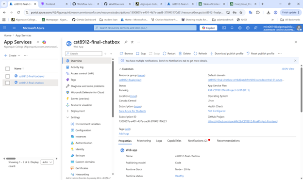

*
 Backend 
*
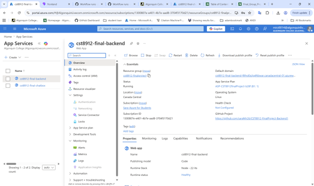

## 6.2 Azure Cosmos DB

Used as a NoSQL database to store posts, user data, and chat-related information (Microsoft, 2024).

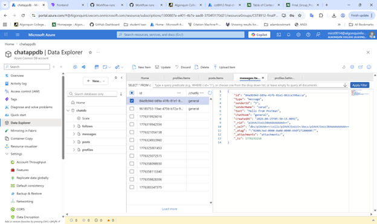

## 6.3 Azure Blob Storage

Used to store images such as post images and profile pictures efficiently.

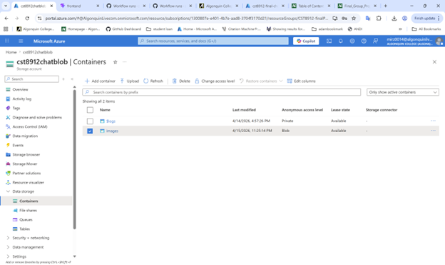

## 6.4 Azure SQL Database

Used for structured data storage and relational data management.

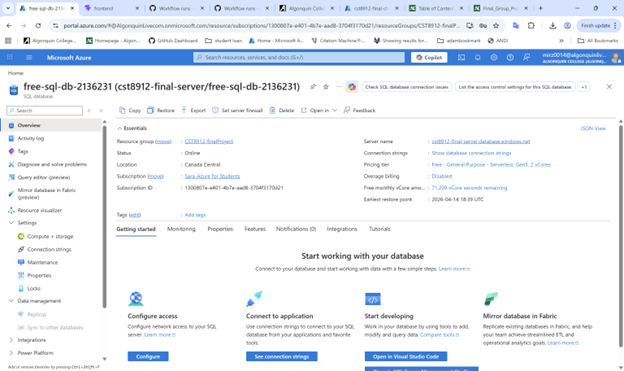

## 6.5 Azure Web PubSub

Azure Web PubSub enables real-time communication in the chat system. It allows users to send and receive messages instantly without refreshing the page, improving user experience and responsiveness (Microsoft, 2024).

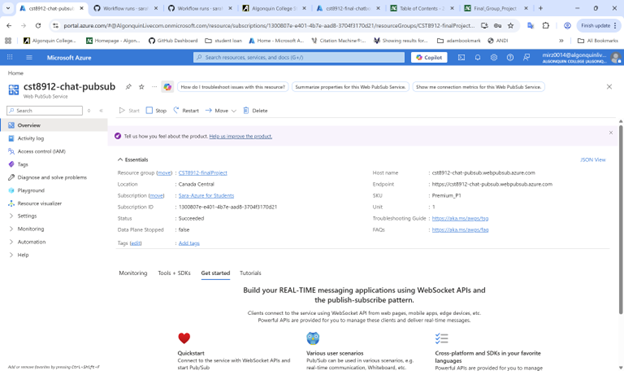

## 6.6 Azure Application Insights

Used for monitoring backend performance, tracking errors, and debugging issues during development.

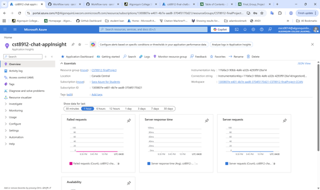

## 6.7 Azure Monitor

Used to track system performance metrics of the backend service. CPU time and memory usage were monitored to analyze resource utilization and identify potential performance bottlenecks.

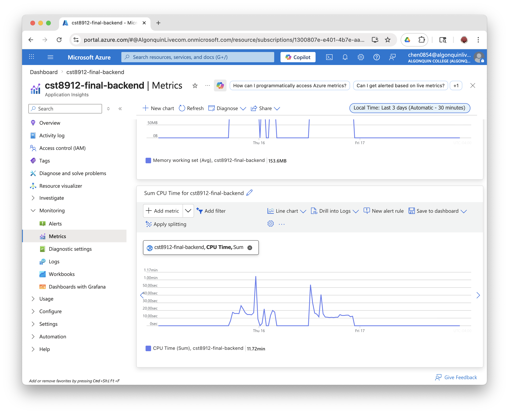
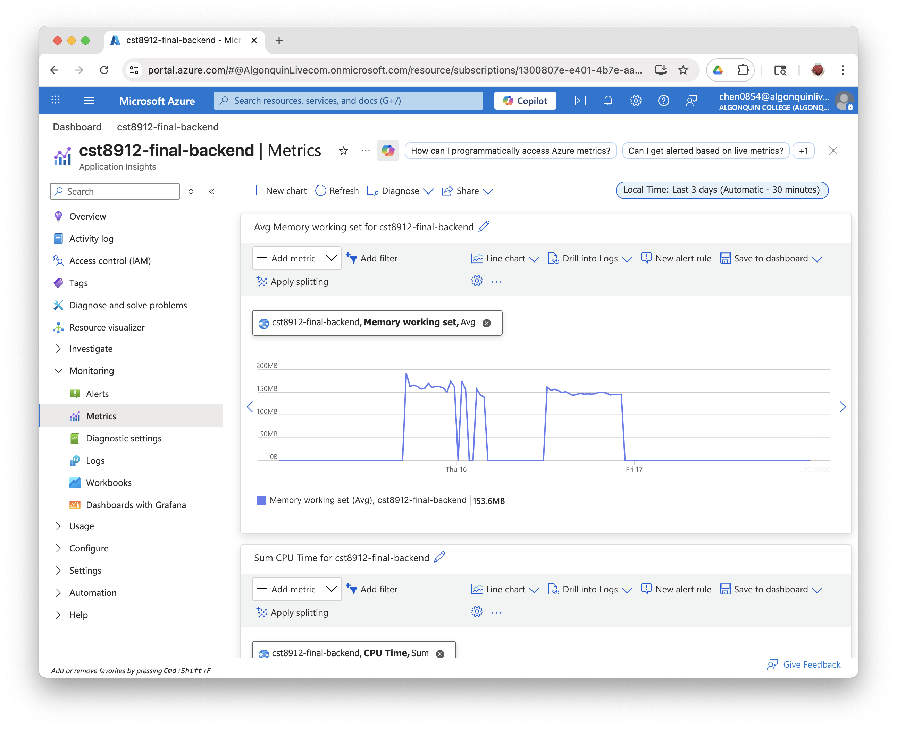

## 6.8 Design Rationale 
The selection of cloud services was based on scalability, performance, and suitability for application requirements.

Azure App Service was chosen to host both the frontend and backend because it supports dynamic server-side logic, environment variable configuration, and seamless deployment through GitHub integration. Compared with static hosting solutions, it offers greater flexibility for full-stack applications (Microsoft, n.d.).

Azure Cosmos DB was selected as the primary NoSQL database due to its ability to handle unstructured and semi-structured data efficiently. Social media data, such as posts, comments, and chat messages, do not require a fixed schema, making Cosmos DB a suitable choice for scalability and performance. (Microsoft, 2025a)

Azure SQL Database was used for authentication and structured user data. A relational database ensures data consistency and integrity, which is critical for managing user credentials and login information. (Microsoft, 2025b)

Azure Blob Storage was implemented for storing media files such as post images and profile pictures. It provides cost-effective and scalable storage optimized for large binary objects, improving performance when handling file uploads and retrieval. (Microsoft, 2022)

Azure Web PubSub was selected to enable real-time communication. It allows bidirectional messaging between clients without requiring custom WebSocket infrastructure, making it efficient and easy to integrate for chat functionality. (Microsoft, 2025)

Azure Application Insights was used for monitoring and diagnostics. It provides real-time performance metrics, error tracking, and logging, which improve system reliability and simplify debugging during development. (Microsoft, 2026)

---

# 7. Video Demo

---

# 8. Features Implementation

## 8.1 Authentication

Secure login and registration using token-based authentication.

 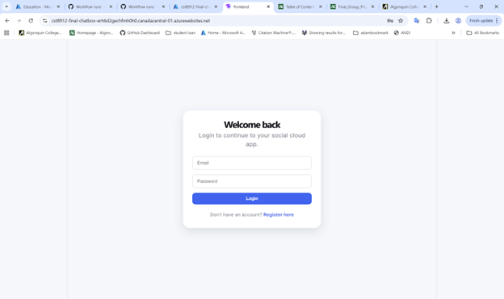  
    
 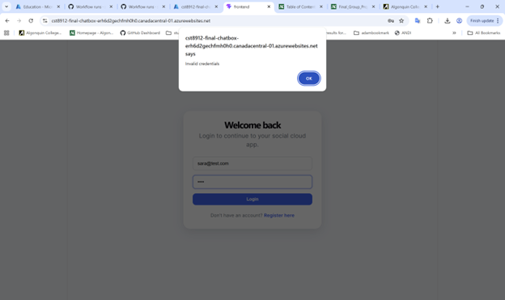
---

## 8.2 Feed System

Users can create, view, and delete posts.

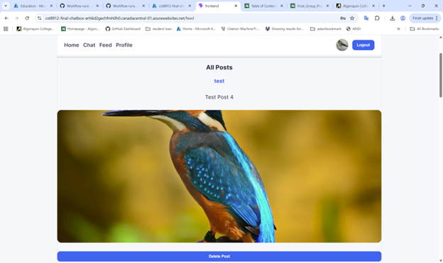

---

## 8.3 Profile System

Users can view and edit profiles, including uploading images.

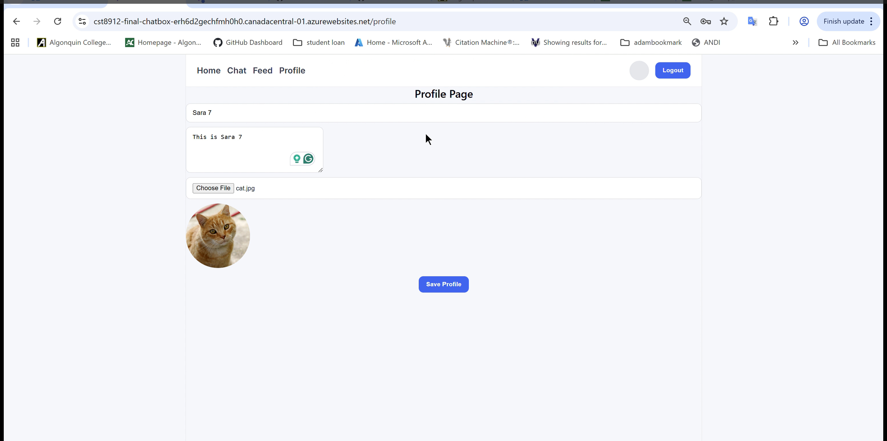

---

## 8.4 Chat System

Users can communicate in real time using Azure Web PubSub.

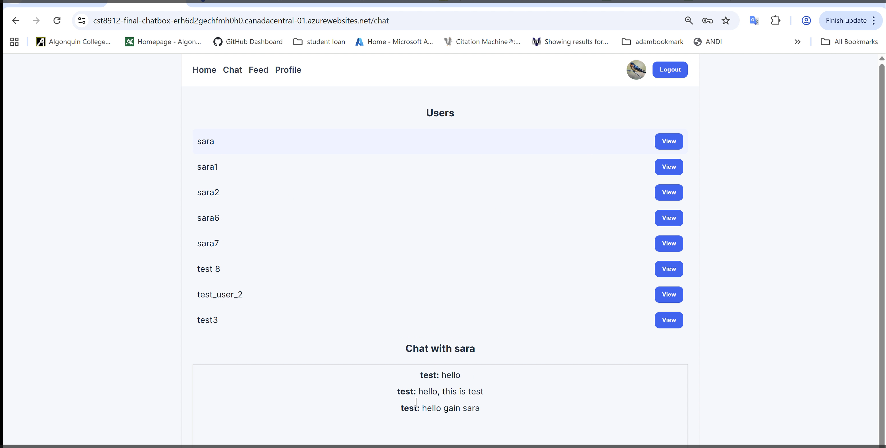

---

## 8.5 Home Page Layout

A centralized dashboard combining users and feeds.

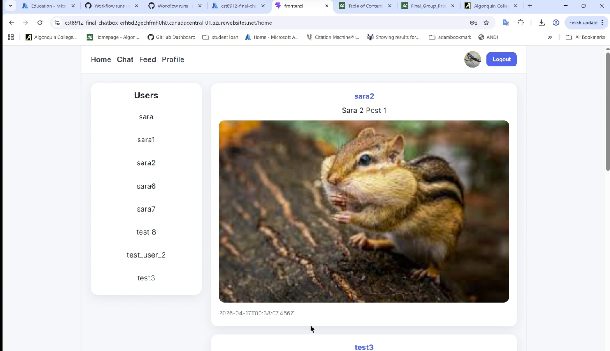

---

# 9. Connectivity and Integration

The application demonstrates full cloud connectivity:

* Frontend → Backend via REST APIs
* Backend → Azure services
* Secure HTTPS communication
* Real-time messaging using Web PubSub

This integration ensures efficient communication across all system components.

---

# 10. Challenges and Solutions

## CORS Issues
Cross-Origin Resource Sharing (CORS) issues occurred because the frontend and backend were deployed on different domains, causing browser requests to be blocked. This issue was resolved by configuring allowed origins in the backend using Express middleware. After the fix, secure communication between the frontend and backend was successfully established.

## Deployment Failures
Deployment failures occurred due to incorrect project structure and missing environment variables in the GitHub Actions workflow. These issues prevented successful builds and application startup. The problem was resolved by restructuring the project directories and properly configuring environment variables in the deployment pipeline. As a result, the application deployed successfully and remained stable.

## Database Connectivity Issues   
The backend initially failed to connect to Azure databases due to incorrect connection strings and firewall restrictions. This was resolved by updating the connection strings and allowing access through Azure firewall settings. Once corrected, the backend was able to reliably access both Cosmos DB and SQL Database.

---

# 11. Future Improvements

Future enhancements could further improve the system.

* Advanced Blob Storage management (compression, validation)
* Integration with Azure AD B2C for secure authentication
* Enhanced chat features (message history, group chat)
* Improved monitoring and analytics
* Advanced user profile customization

These improvements would make the system more scalable and production-ready.

---

# 12. Conclusion

This project demonstrates how cloud computing can be used to build a modern, scalable, and interactive application. The transition from Phase 2 to the final implementation significantly improved functionality, usability, and system reliability.

The integration of multiple Azure services highlights the importance of well-designed cloud architecture in supporting real-time communication, distributed data storage, and scalable application deployment.

Overall, the project reflects the practical application of cloud solution architecture principles and provides a strong foundation for further enhancements toward a production-ready system.

---
# 13. Frontend and Backend Repository

This project consists of separate frontend and backend repositories hosted on GitHub.

Frontend Repository:
https://github.com/saraMir26/CST8912-FinalProject-Frontend

Backend Repository:
https://github.com/saraMir26/CST8912-FinalProject-Backend1

These repositories include all source code, configuration files, and documentation required to run the application.

---

# 14. How to Use the Application

Users can access the application through the deployed frontend URL.

1. Register a new account or log in using existing credentials  
2. Create posts and upload images through the feed page  
3. View and interact with other users’ profiles  
4. Edit personal profile information, including profile image and bio  
5. Use the chat page to communicate with other users in real time  

The application is designed with a simple navigation structure, allowing users to move between Home, Feed, Chat, and Profile pages efficiently.

# 15. Work Distribution

The project was completed through collaborative teamwork, with responsibilities distributed across different components of the system.
* Yiming He: Frontend deployment and backend integration during Phase 2
* Sara Mirzaei: User interface improvements and backend enhancements in Phase 3
* Xinyi Zhao: System architecture design, testing, and documentation
* Hesheng Yang: Presentation delivery and project explanation
* Bosi Chen: Presentation delivery, project explanation and performance monitoring using Azure Monitor Metrics in Phase 3

This distribution ensured efficient collaboration and allowed each team member to contribute based on their strengths, resulting in a well-integrated and functional system.

# 16. References

Microsoft. (2024). *Azure documentation*. https://learn.microsoft.com/azure

React Documentation. (2024). https://react.dev

Node.js Documentation. (2024). https://nodejs.org

Algonquin College Library. (2024). *APA citation guide*. https://algonquincollege.libguides.com

Microsoft. (n.d.). Azure App Service documentation - Azure App Service. Learn.microsoft.com. https://learn.microsoft.com/en-us/azure/app-service/   

‌Microsoft. (2025, December 19). Quickstart - Azure portal - Azure Cosmos DB. Microsoft.com. https://learn.microsoft.com/en-us/azure/cosmos-db/quickstart-portal   

‌Microsoft. (2025, June 17). What is the Azure SQL Database service? - Azure SQL Database. Microsoft.com. https://learn.microsoft.com/en-us/azure/azure-sql/database/sql-database-paas-overview?view=azuresql-db&preserve-view=true    

Microsoft. (2022, November 21). About Blob (object) storage - Azure Storage. Learn.microsoft.com. https://learn.microsoft.com/en-us/azure/storage/blobs/storage-blobs-overview   

‌Microsoft. (2025, May 28). What is Azure Web PubSub service? Microsoft Learn. https://learn.microsoft.com/en-us/azure/azure-web-pubsub/overview   
‌
Microsoft. (2026, April 2). Azure Monitor Insights Overview - Azure Monitor. Microsoft Learn. https://learn.microsoft.com/en-us/azure/azure-monitor/visualize/insights-overview

Microsoft. (2026, May 20). Azure Monitor Metrics overview - Azure Monitor. Microsoft Learn. https://learn.microsoft.com/en-us/azure/azure-monitor/metrics/data-platform-metrics

---
